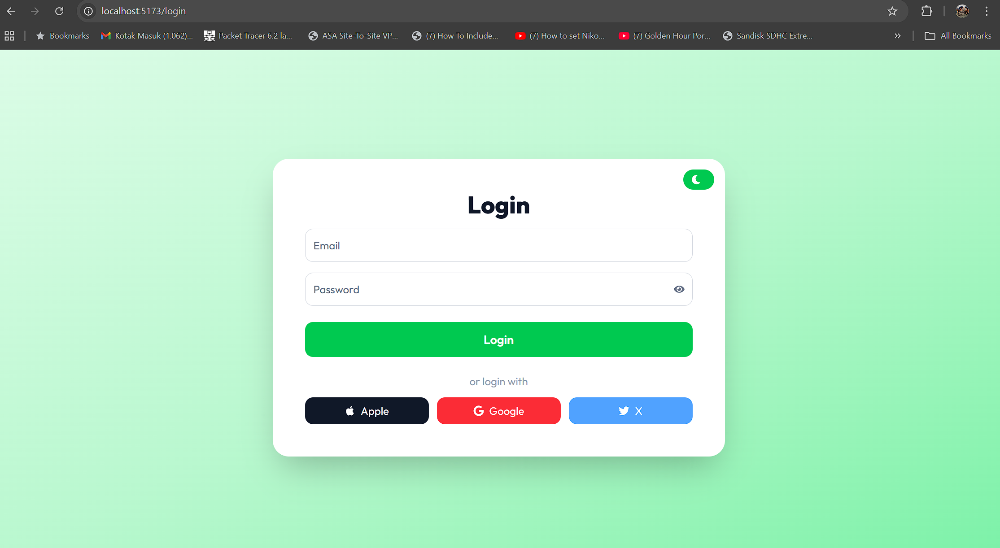

---

## **2. README React Vite (Frontend)**

```markdown
# TailAdmin - React.js Frontend (Vite)

## Deskripsi
Frontend TailAdmin menggunakan **React.js + Vite + Tailwind CSS**. Berinteraksi dengan backend Next.js API untuk login, logout, dan dashboard.

---

---

## **2. README React Vite (Frontend)**

```markdown
# TailAdmin - React.js Frontend (Vite)

## Deskripsi
Frontend TailAdmin menggunakan **React.js + Vite + Tailwind CSS**. Berinteraksi dengan backend Next.js API untuk login, logout, dan dashboard.


---

## **2. README React Vite (Frontend)**

```markdown
# TailAdmin - React.js Frontend (Vite)

## Deskripsi
Frontend TailAdmin menggunakan **React.js + Vite + Tailwind CSS**. Berinteraksi dengan backend Next.js API untuk login, logout, dan dashboard.

---

## Tech Stack
- **Frontend:** React.js, Vite, React Router, Tailwind CSS, React Helmet
- **Authentication:** JWT (disimpan di cookie HTTP Only)
- **UI Components:** PageMeta, PageBreadcrumb, ProtectedRoute

---

## Struktur Proyek


****
```bash
src/
├─ pages/
│ ├─ Login.tsx
│ └─ Dashboard.tsx
├─ components/
│ ├─ ProtectedRoute.tsx
│ ├─ PageMeta.tsx
│ └─ PageBreadcrumb.tsx
App.jsx
index.jsx
```

---


## Setup

 **Install dependencies**
```bash
npm install

npm run dev

Frontend berjalan di http://localhost:5173

Routing

/ → Login page

/dashboard → Dashboard (ProtectedRoute)

ProtectedRoute

Mengecek endpoint backend GET /api/auth/me.

Jika JWT valid → akses dashboard.

Jika tidak → redirect ke login.

Catatan

Pastikan backend Next.js berjalan di http://localhost:3000

Gunakan cookie token untuk autentikasi. 

```
 **Berikut diagram arsitektur sederhana untuk project React Vite frontend + Next.js backend + PostgreSQL:**
```bash
+----------------+         HTTPS/HTTP          +------------------+       SQL       +------------------+
| React.js Vite  | <------------------------> | Next.js API      | <------------> | PostgreSQL        |
| Frontend       |                             | Backend          |               | Database (user)  |
| (localhost:5173)|                             | (localhost:3000) |               | schema: "user"  |
+----------------+                             +------------------+               +------------------+
         |                                               ^
         |                                               |
         | 1. Login (email/password)                     |
         |---------------------------------------------->|
         |                                               |
         |                                               |
         | 2. Backend validates credentials             |
         |    - bcrypt compare                           |
         |    - JWT sign                                  |
         |                                               |
         | 3. Set HTTP Only Cookie "token"              |
         | <------------------------------------------- |
         |                                               |
         | 4. Access Protected Route (/dashboard)       |
         |---------------------------------------------->|
         |                                               |
         | 5. Backend verifies JWT in cookie            |
         |                                               |
         | 6. Returns user info if valid               |
         | <------------------------------------------- |
         |                                               |
         | 7. Frontend renders Dashboard               |
         |                                               |
```

 **Berikut tampilan screen shoot UI:**





Dark Mode


Light Mode


